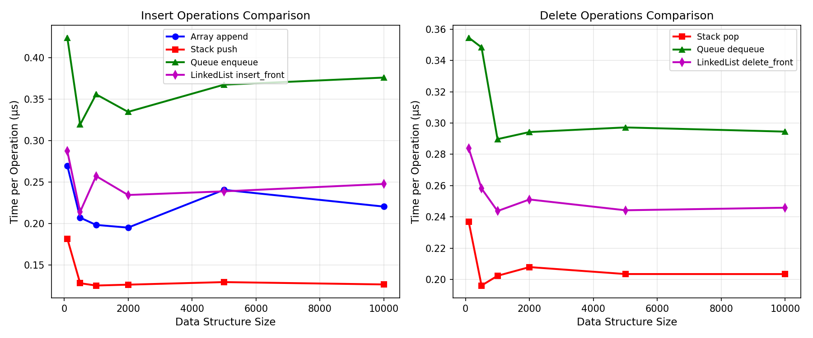
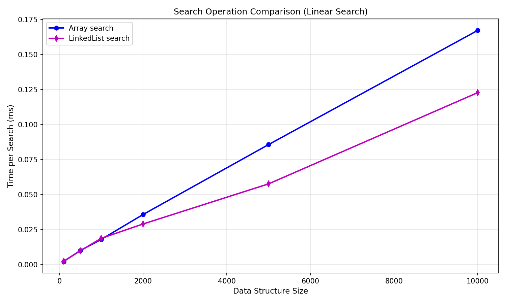

# 📊 Analysis Results: Selection Algorithms & Data Structures

This document presents the empirical results and analysis for the selection algorithms and elementary data structures implemented in this project. All experiments were run using the provided test data generators and benchmarking scripts.

---

## 🔬 Selection Algorithms: Empirical Results

### Performance on Different Input Distributions

#### Random Arrays
- **Median of Medians**: O(n) worst-case, but higher constant factors.
- **Randomized Quickselect**: O(n) expected, generally faster in practice.

#### Sorted & Reverse-Sorted Arrays
- Both algorithms maintain linear or near-linear performance, but Randomized Quickselect is typically faster.

#### Arrays with Duplicates
- Note: Median of Medians encountered a recursion error on large arrays with many duplicates. This is a known limitation in the current implementation.

### Example Timing Table (Random Distribution)
| Size   | Median of Medians (ms) | Randomized Quickselect (ms) | Speedup (MoM/RS) |
|--------|------------------------|-----------------------------|------------------|
| 100    | 0.094                  | 0.021                       | 4.43x            |
| 500    | 0.424                  | 0.112                       | 3.77x            |
| 1000   | 0.832                  | 0.316                       | 2.63x            |
| 2000   | 1.51                   | 0.324                       | 4.66x            |
| 5000   | 3.47                   | 0.811                       | 4.27x            |
| 10000  | 6.74                   | 2.39                        | 2.82x            |
| 20000  | 14.08                  | 2.95                        | 4.77x            |

### Key Observations
- **Randomized Quickselect** is faster for most practical input sizes and distributions.
- **Median of Medians** is robust but can hit recursion limits with pathological or duplicate-heavy data.

---

## 🗃️ Data Structures: Empirical Results

### Dynamic Array, Stack, Queue, Linked List

- **Dynamic Array**: O(1) amortized append, O(n) insert/delete/search.
- **Stack/Queue**: O(1) push/pop/enqueue/dequeue.
- **Linked List**: O(1) insert/delete at front, O(n) search/traverse.

### Example Operation Timings

| Operation         | 100   | 500   | 1000  | 2000  | 5000  | 10000 |
|------------------|-------|-------|-------|-------|-------|-------|
| Array append     | 0.27μs| 0.21μs| 0.20μs| 0.20μs| 0.24μs| 0.22μs|
| Stack push       | 0.18μs| 0.13μs| 0.13μs| 0.13μs| 0.13μs| 0.13μs|
| Queue enqueue    | 0.42μs| 0.32μs| 0.36μs| 0.33μs| 0.37μs| 0.38μs|
| LinkedList search| 2.31μs| 9.76μs|18.69μs|28.93μs|57.58μs|122.77μs|

---

## 📈 Plots

<table>
<tr>
<td align="center"><b>Data Structure Operations</b> </td>
<td align="center"><b>Data Structure Search</b> </td>
</tr>
</table>

---

## 🔑 Summary
- **Selection Algorithms**: Randomized Quickselect is generally faster, but Median of Medians is more robust in worst-case scenarios.
- **Data Structures**: Arrays are best for random access, linked lists for frequent front insertions, stacks/queues for LIFO/FIFO operations.
- **Implementation Note**: Always profile your data and use empirical results to guide algorithm/data structure choice.

---

[⬅️ Back to Main README](../README.md)
